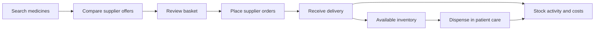
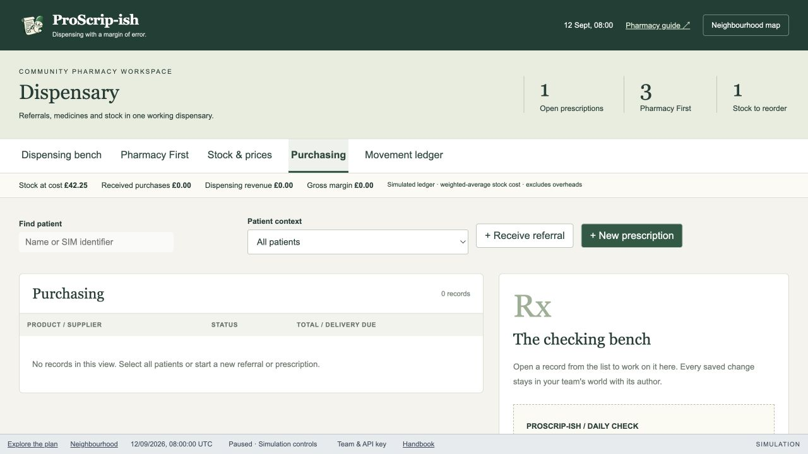
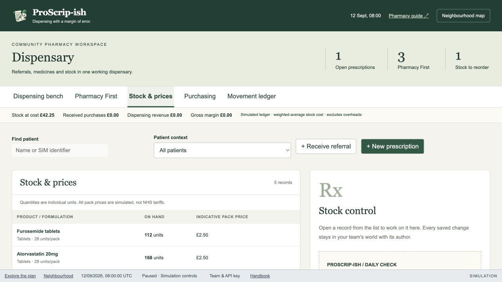
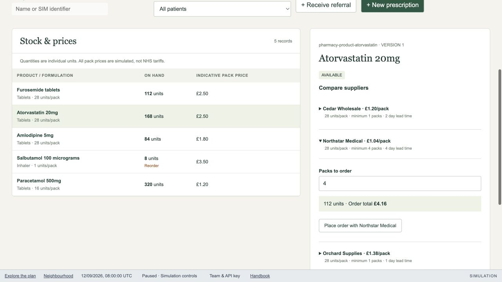
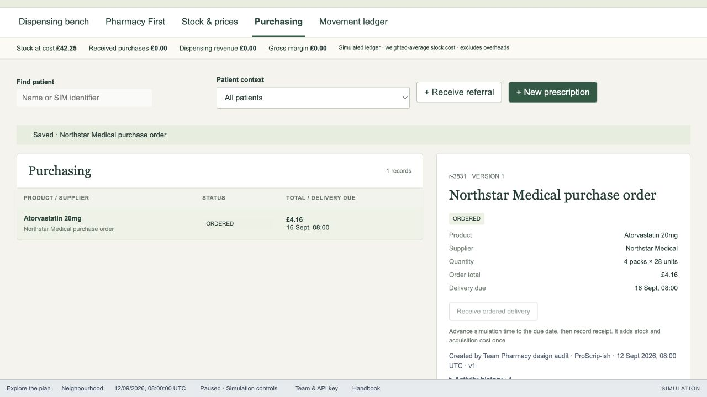
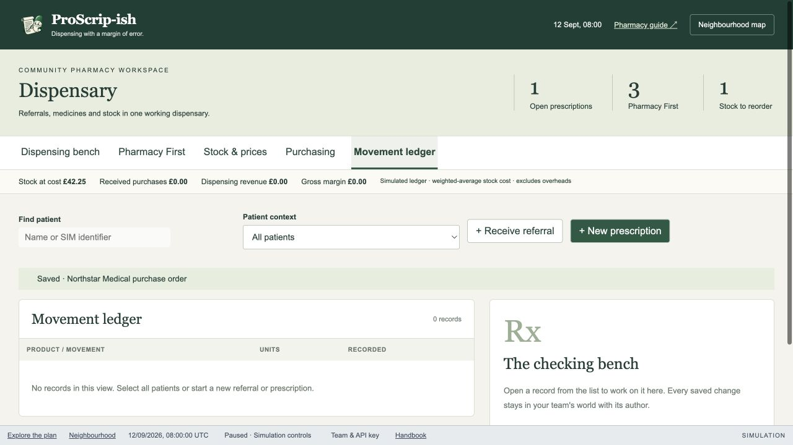

# NoobScript: stock and buying

Status: design plan, 10 September 2026. Based on a fresh browser audit of the running simulator and the current pharmacy contracts/UI. Prices below are synthetic examples from the simulator.

## Decision

Make procurement a pharmacy-wide workspace organised around drugs, supplier offers, baskets and purchase orders. Patient selection belongs only to dispensing and Pharmacy First. A user must be able to compare prices, buy stock, receive deliveries and explain costs without opening a patient.

Keep NoobScript's green and cream identity and compact top navigation. Replace the generic two-column record viewer with screens designed for the work being done. Keep the simulation clock and Team & API key footer accessible.

The first useful release is a complete purchase journey, not a patient-picker removal followed by another empty table.

## Audit: what happens today

Audited in an isolated local team using the in-app browser at 1280 × 720. No patient was selected. The simulated clock was 12 September 2026, 08:00.

| Step | Observed state | Health | Design consequence |
| --- | --- | --- | --- |
| 1. Open Purchasing | Empty order history; no buy action. Patient search, referral and prescription actions dominate. Empty copy tells the buyer to create a referral or prescription. | Poor: wrong entry point and next action. | Purchasing must open a searchable buying catalogue. Put existing orders in Orders. |
| 2. Open Stock & prices | Five stock records; the first screen gives little space to the table. Atorvastatin's headline £2.50 is the simulated selling price. | Poor: ambiguous price and no clear comparison action. | Separate buying price, inventory acquisition cost and simulated dispensing revenue. Give the catalogue the full content width. |
| 3. Select a drug and expand a supplier | A comparison list appears in a narrow details panel; each supplier hides its order form in an accordion. | Partial: real quotes, pack sizes, minimums and lead times exist, but comparison is hard to discover and scan. | Show a full-width offer table with comparable quantities and explicit Compare suppliers / Add to basket actions. |
| 4. Place an order | Four packs of 28 Atorvastatin units bought from Northstar for £4.16; order due 16 September. No patient was required. Receipt is disabled until due, with explanatory copy. | Working core, weak checkout: single-product immediate purchase and no basket. | Preserve frozen order prices, attribution and delivery timing; add a persistent basket and review step. |
| 5. Open Movement ledger | Zero movements while stock value is £42.25. The new unreceived order is absent, correctly, but there is no opening balance explanation. Copy again suggests referrals and prescriptions. | Poor explanation: stock movements, order activity and money are conflated. | Separate stock movements from order activity; show opening stock and reconcile balances. |

Screenshots, captured and inspected during this audit:

### 1. Purchasing entry

### 2. Stock catalogue

### 3. Supplier comparison

### 4. Order placed

### 5. Movement ledger

The current UI also applies the selected-patient filter to every record type. Products and orders usually have no patient ID, so they remain visible; patient-linked dispensing movements can disappear from the ledger while the financial totals still describe the whole pharmacy. This is a state-scoping defect, not just misleading copy.

Accessibility observations: tables have column headers, controls have labels, and order success is announced through a status region. Small supplier disclosure targets, dense secondary text and off-screen buying controls need attention. This audit did not establish keyboard-only usability, screen-reader usability, contrast compliance or mobile reflow. Receipt and dispensing were not executed in this audit run; order placement and its due-date state were verified.

## Navigation and state

Two top-level areas in the existing pharmacy header:

| Area | Views | Context |
| --- | --- | --- |
| Patient care | Dispensing; Pharmacy First | Patient search when working on a patient. |
| Stock & buying | Buy medicines; Inventory; Orders; Stock activity; Performance | Pharmacy-wide. Drug, supplier, order and date filters only. |

Use local top navigation, not a permanent large sidebar. Stock & buying opens Buy medicines by default. Basket count and total remain visible in that area. Patient-care context can be remembered when returning to care, but must never filter procurement queries, movements or totals. A legacy `?patient=` URL must not change procurement results.

Each screen has its own page title and useful primary action. Remove the large Dispensary hero, clinical counters, patient actions and checking-bench panel from procurement screens. Show only context-relevant totals. Advanced filters and transaction details open on demand.

## Screen and interaction design

### Buy medicines

Top row: drug search, optional formulation/strength filters, and View basket with count and total. The main area is a catalogue table, including products with zero stock and products not yet bought. Search must not be restricted to the five products currently stocked.

Rows show exact drug identity, formulation/strength, available own stock, on-order units, lowest comparable supplier offer, earliest delivery and Compare suppliers. Do not show a selling price as a buying price. A low-stock filter is useful; unrelated financial and clinical metrics are not.

Selecting Compare suppliers opens a dedicated comparison view. Keep the drug identity, own-stock position and requested quantity visible above the offer table. The previous search is preserved when returning.

### Compare suppliers

Compare offers for the same clinical product and compatible units. Differences in strength, formulation or route are not a price substitution. Manufacturer/brand and pack details remain visible; buying must not silently change a prescription's medicine.

Columns: supplier; pack contents; price per pack; comparable unit price; supplier availability; minimum packs; packs required for the requested quantity; units supplied; excess units; delivery date; total landed cost; Add to basket.

Changing the required quantity recalculates every offer. A minimum quantity must be shown before adding, not discovered through validation after submission. Quote age/expiry and unavailable offers need explicit states. Delivery charges and discounts, when modelled, are included in the quoted total and shown separately. No invented live wholesaler prices.

Current synthetic example for 112 units of Atorvastatin 20mg, packs of 28:

| Supplier | Pack price | Minimum packs | Delivery lead | Required packs | Goods total |
| --- | ---: | ---: | ---: | ---: | ---: |
| Cedar Wholesale | £1.20 | 1 | 2 days | 4 | £4.80 |
| Northstar Medical | £1.04 | 4 | 4 days | 4 | £4.16 |
| Orchard Supplies | £1.38 | 1 | 1 day | 4 | £5.52 |

These observed offers do not currently model delivery fees. The new UI must say what its total includes. For a request of only 28 units, Northstar still requires £4.16 and supplies 112 units; its lowest unit price is not the lowest cash outlay. The comparison must make that tradeoff obvious.

### Basket and order review

Persist the basket in the team world so users and their agents see the same proposed purchases. Support multiple drugs and suppliers. Group lines by supplier, show quantity in packs and units, goods subtotal, any simulated delivery charge/discount, total, expected arrivals and the resulting stock position. Allow editing/removing lines without leaving the basket.

The explicit action is Place orders. The review states how many supplier orders it will create. Revalidate quote versions, availability and minimums before placement. Changed quotes return a visible comparison and require a new review; never silently reprice. Repeated clicks or retries must not duplicate an order. A receipt gives stable order numbers and links to each order.

### Orders and receiving

Order states: Draft, Ordered, Part received, Received, Cancelled. Filter by supplier, drug, status and due date. Orders list committed spend and outstanding units. Opening an order shows its frozen prices, lines, expected delivery and activity history.

Receive delivery is available when due in the simulation. Record actual quantities per line, preserving the remaining balance on partial receipt. Record supplier discrepancies rather than pretending the complete order arrived. Cancellation applies only to unreceived quantities and releases the remaining commitment.

An order waiting for simulated time shows its due date and a shortcut to the existing time control. Explain that advancing time affects the entire team world. Keep the main receipt action and confirmation visible after scrolling.

### Inventory

Show on hand, reserved for dispensing, available, on order, reorder threshold, target stock and acquisition value. Packs and individual units are explicit and consistent. Stock cover is shown only when there is a named demand estimate; unknown demand is not displayed as zero.

Drug detail exposes stock batches, expiry where modelled, recent purchases, supplier comparison, and movement history. Stocktake adjustments require a quantity and reason. Expired/quarantined units are not available to dispense. Transfers between branches are later scope, not a fake action in the first release.

### Stock activity

Use an explained transaction table: time, drug, movement type, units in/out, running balance, cost impact, reference and author. Filters apply to the pharmacy-wide movement stream, never the current patient. Patient information appears only when drilling into a dispensing transaction.

Opening stock, receipt, dispensing, return, write-off and stocktake adjustment each have clear labels. An order placement is an order event, not a stock movement. Link it from Orders; do not increment stock before receipt. Every balance must reconcile to opening balance plus subsequent movements.

For existing worlds, preserve historical movements and attribution. Establish a clearly labelled opening balance or reconciliation baseline from the available stock and transaction data, without inventing historical suppliers or authors. If history cannot fully reconstruct the opening position, state that limitation instead of presenting fabricated transactions.

Empty copy must explain the actual state. For example: “No stock movements in this period. Opening stock: 168 units. Your 112-unit order is due on 16 September.” Give a relevant View order or Buy medicines action. Hide irrelevant detail panels until a transaction is selected.

### Performance

Provide a time range, a currency amount plus definition for each measure, and drill-down to its transactions. Separate:

- Outstanding order commitments, which are not stock on hand.
- Received acquisition cost and closing inventory value.
- Cost of medicines actually dispensed, with the chosen inventory-cost method.
- Simulated dispensing revenue and gross contribution after drug costs.
- Waste/write-offs and delivery charges under a declared costing policy.

Do not label gross contribution as net profit. Net P&L requires a defined overhead and revenue model. All prices/revenue in this simulator remain fictional; neither live tariffs nor real reimbursement are implied. Changing a current price must not rewrite earlier orders or dispensing margins.

## Model and API work

Reuse the existing product, supplier quote, order and movement records, simulation clock, team isolation, version checks and attribution. The architecture remains one app/public port with PostgreSQL. This work extends pharmacy contracts rather than adding a disconnected shop.

The current foundation supports five stocked products, three quotes per product, single-line orders, due dates, complete receipt, stock acquisition value and dispensing movements. It needs these additions for the planned experience:

| Model | Required additions |
| --- | --- |
| Catalogue product | Explicit strength/form/route identity and unit definition; separate purchasable catalogue from own inventory. |
| Supplier offer | Availability, validity/version, comparable pack units and explicit fee/discount assumptions. |
| Basket | Team-owned lines, required quantity, selected offers, versions and computed totals. |
| Purchase order | Supplier-grouped lines, frozen commercial terms, received/outstanding quantities and cancellation state. |
| Inventory | Available/reserved/on-order quantities; explicit opening balance; batch/expiry support when enabled. |
| Movement | Typed movement reason, quantity/value delta, references, author and durable balance reconciliation. |

Use integer currency totals with explicit allocation/rounding when distributing cost across individual units. Placement and receipt are transactions with idempotency keys and expected versions. Checkout creates its supplier orders atomically; partial failure must not leave the user guessing which orders exist. Receipt adds stock/value once. Concurrent dispensing and receipts cannot overwrite each other or produce negative availability.

The frontend should have distinct procurement views, not another set of branches in the shared patient-record table. Give procurement its own filters and query keys. Preserve existing pharmacy data through an additive migration; do not reset team worlds.

## The agent opportunity

Expose the same catalogue, offers, stock, orders and costs through team-authenticated APIs. An agent can propose a basket using a spending cap, target stock, delivery deadline, demand assumption and acceptable supplier set. Each proposed line explains the selected offer and alternatives, including why the cheapest unit price may not meet the user's goal.

Start with a proposal that the user can edit or place. Later, user-configured automation can place orders within explicit limits. Reuse the ordinary order endpoints and audit history; do not build an invisible second ordering path. Budget caps, service-level requirements, expiry/waste and stockouts constrain optimisation. Maximising margin must not mean ignoring dispensing commitments or treating a medicine substitution as a purchasing choice.

Expand the synthetic scenario beyond five products: a useful initial target is 30–50 catalogue products, several suppliers, differing minimums/lead times and a mixture of low stock, surplus, pending deliveries and near-expiry stock. Include a reproducible scenario where consolidating orders saves money, and one where paying more for earlier delivery is preferable. Demand assumptions and expected outcomes should be inspectable.

## Delivery sequence

1. **Complete patient-free buying.** Split care/procurement context, build catalogue and full-width comparison, persistent multi-line basket, review and supplier orders. Keep existing data. Acceptance: a new team with no patient can buy an unstocked product and see its order.
2. **Receiving and reconciliation.** Partial receipt/cancellation, inventory availability, labelled opening balances and useful stock activity. Acceptance: order → partial receipt → final receipt → dispense reconciles units and value after reload, retry and concurrent updates.
3. **Performance and agent purchasing.** Cost drill-downs, clear margin definitions, synthetic demand scenarios, replenishment proposals and budget limits. Acceptance: a deterministic agent proposal can be explained, edited, placed and compared with a baseline without exceeding its constraints.

All three are part of the planned product. Phase one must still end with a usable purchase flow; it is not a cosmetic intermediate release.

## Acceptance checks before release

- No patient picker, referral button or prescription button appears anywhere in Stock & buying. Carrying a selected patient from care cannot change catalogue, order, ledger or financial totals.
- Buy medicines is useful with no inventory and no prior orders. Supplier comparison is reachable directly from a search result.
- Pack-size differences, minimums, delivery dates, excess units and total costs are comparable for one requested quantity. Offers for incompatible products are not ranked together.
- A multi-drug basket survives reload; changed quotes are explained; duplicate submits produce one order set.
- Ordering changes committed/on-order amounts, not on-hand inventory or realised margin.
- Partial and full receipts reconcile stock and value; repeated receipt is harmless or rejected without another movement.
- Dispensing consumes available stock, preserves its historical cost and links to the global ledger. A patient filter in care cannot hide those movements from procurement.
- Every displayed stock balance and cost total has an explanation and traceable records, including imported/opening positions.
- Errors retain basket/form input. Loading, no results, out of stock, quote expiry and delivery-not-due states have appropriate actions.
- Verify keyboard-only search/comparison/checkout, visible focus, labelled quantity controls, non-colour status cues, readable tables at 200% zoom and responsive layouts. The fixed footer must not cover totals or actions.
- Run the repository checks, Compose journeys and browser QA locally and on live, including an existing team. Do not claim success from a build alone.

## Next design artifact

Design the supplier-comparison screen and basket review together, using the same quantity/cost example. They must demonstrate the complete purchase decision before implementation starts. Carry the approved structure through receiving and stock activity; do not choose an attractive dashboard that leaves the buying interaction unresolved.
